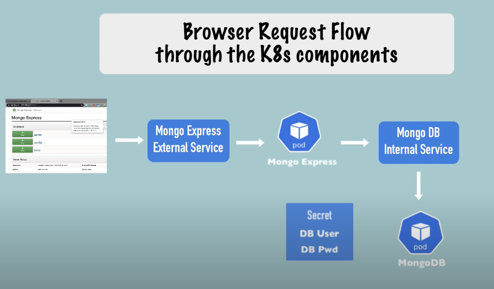

# Kubernetes (K8s)
- One of the most popular **container orchestration tools**
- Helps manage containerised applications in different deployment environments

## Features
- High availability or no downtime
- Scalability or high performance
- Disaster recovery: backup and restore

## [Architecture](https://kubernetes.io/docs/concepts/overview/components/)

A Kubernetes cluster contains a set of worker nodes and at least one master node, and a virtual network to connect all the worker nodes (that forms like a big machine)

### Master node (The control plane)
- API Server
    - Entrypoint to the cluster
- Controller manager
    - Keeps track of what's happening in the cluster
- Scheduler
    - Schedule containers on different worker nodes based on workload
    - Ensures Pods placement
- etcd
    - Holds Kubernetes backing key value store for all cluster data

### Worker node
- Has a [kubelet](https://kubernetes.io/docs/reference/command-line-tools-reference/kubelet/) process running as the primary "node agent"
- Will have different containers working

## Some Major Components

### Pod
- Smallest unit of K8s
- **Non-permanent** resources
- **Abstraction over containers** (so that whatever container technology is fine)
- **Usually 1 application container per Pod** (still you can have multiple containers per Pod for helper or side service)
- Multiple Pods in each worker Node
- Each Pod have its own IP address to communicate with each other through the virtual network
- New IP address on re-creation

#### Service
- **Allows permanent IP address for each Pod**
- Lifecycle of Pod and Service **is not connected**, i.e. if the Pod dies, the Service and IP address still stays
- Also a load balancer
- **External and Internal service**
- Ingress to handle External service into the cluster

#### ConfigMap
- **External configuration** of my applications, e.g. Database URL
- Centralised so that other components can use it
- Connected to the Pod
- Avoid the need to rebuild images for small config changes
- Do not put credentials into ConfigMap

#### Secret
- Used to store secret data, e.g. passwords, credentials
- base64 encoded
- Connected to the Pod

#### Volumes
- Allow data persistent storage
- Can be local or remote storage

#### Deployment
- Abstraction over Pods
- **Usually we interact with Deployments instead of Pods**
- Specify the blueprint for pods
- Allow replicas of pods for high availability
- Cannot and should not replicate database Pods via Deployment

#### StatefulSet
- For stateful apps or databases e.g. MySQL, MongoDB
- Similar to Deployment for replicas
- Difficult to implement
- Instead DBs are often hosted outside of K8s cluster

## Tools
### [kubectl](https://kubernetes.io/docs/tasks/tools/)
- Command line tool for K8s cluster
- Talk to the API Server in the Master processes

### [minikube](https://minikube.sigs.k8s.io/docs/start/)
- Runs **a single-node K8s cluster** for testing purposes
- Node runs in a created virtual machine by minikube

## Get Started
```sh
# Start/stop a K8s cluster
minikube start
minikube stop
minikube status
```

### Displaying Status of Resources
```sh
kubectl get nodes/pod/service/deployment/secret -o wide #etc.
kubectl get all
```

### Creating Deployment
```sh
# create a deployment named nginx-depl running the nginx image
kubectl create deployment nginx-depl --image=nginx
```

### Logging and Debugging
```sh
# print the logs for a container in the pod
kubectl logs pod_name
# show details of a specific resource
# can be resources other than pod
kubectl describe pod pod_name
# get inside the pod with bash
kubectl exec -it pod_name -- bash
```

### Config file to Create Components
- Easier to manage
- Example in `nginx-deployment.yaml`
- K8s knows when to create or update deployment (if it exists already)

```sh
# avoid typing out all the options in CLI
kubectl apply -f config-file.yaml
```

### Example with MongoDB

1. Create a MongoDB deployment first in `mongodb.yaml`
2. `mongodb-secret.yaml` specifies the username and password for the database
3. Secret must be created **before** MongoDB Deployment
```sh
# Creat the secret with username and password
kubectl apply -f mongodb-secret.yaml
kubectl apply -f mongodb.yaml
```
4. Make sure the Deployment file references the Secret
5. Add another document in `mongodb.yaml` for creating internal Service
6. Create a mongo-express deployment for front-end interface `mongo-express.yaml`
7. `mongo-configmap.yaml` specifies the database URL for mongo-express
8. Again, ConfigMap needs to be created first before referencing in Deployment
```sh
kubectl apply -f mongo-configmap.yaml
kubectl apply -f mongo-express.yaml
```
9. Create mongo-express **external service** in another document in `mongo-express.yaml`
10. `minikube service mongo-express-service` to open the external service
