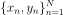
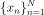
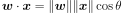
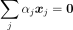
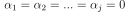
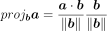

# Basic Concepts

1. Supervised learning:

    - Training data includes labels as well
    - Work through some optimisation routine to minimise a loss or error function
    - e.g. Email spam classification, linear regression, Support Vector Machine (SVM), neural network
2. Unsupervised learning:

    - Training data is unlabelled
    - Help find previously unknown patterns in dataset
    - e.g. Clustering, Principal Component Analysis (PCA)
3. Semi-supervised learning
    - Partially labelled training data
    - e.g. Deep belief networks (Google Photos' people tagging)

## Notes on Linear Algebra
Some notes on linear algebra that could be useful in understanding the derivations of some machine learning algorithms later.

### Dot product

### Linear independence
A set of vectors is **linearly independent** if the vector equation \

has only the trivial solution

### [Vector projection](https://en.wikipedia.org/wiki/Vector_projection)
Vector projection of vector _a_ onto vector _b_ \

### Gradient vector
For a multivariable function,

, the gradient is denoted as:

The gradient vector, if evaluated at an input **_x_**, points in the direction of **steepest ascent**.

---

**Read [The Matrix Cookbook](../files/matrixcookbook.pdf) for quick reference to matrices operations, eigenvectors and eigenvalues, and singular value decomposition (SVD)**
