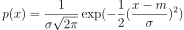
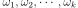

## Gaussian Density
### Notation
> The fomulas are estimates from a number of sample points.

Multivariate mean:  \
Covariance matrix: 

Note that covariance matrix is **symmetric positive definite**.

### Formulas
Univariate:  \
Multivariate: 

### Linear Transformation of Gaussian Density
Given 
and
, \
then

### Central Limit Theorem (CLT)
In CLT, by sufficiently large samples from an unknown distribution, the distribution of the sample means will **approximate a Gaussian distribution**. Therefore, from adding and subtracting uniform random numbers, we can get a univariate Gaussian density.

Combining two univariate Gaussian densities can form a multivariate Gaussian which is uncorrelated. From there, make use of the linear transformation above to produce a **correlated multivariate Gaussian density**.

<!--TODO: insert a graph if necessary-->

### Projecting Gaussian Density
By projecting a correlated multivariate Gaussian density onto a direction (with a unit vector),
the variance of projection is .

The **maximum and minimum of variance of projection** will coincide with the eigenvalues of the covariance matrix, where the directions are the corresponding eigenvectors.

<!--TODO: illustrate it in the code-->

## Bayesian Decision Theory
_e.g. Probability of sickness given some tests_

A data point (_e.g. test results_):  \
K classes: 

Priors (some expert knowledge in the domain): 

Likelihood (experiment measure/effect): 

**Posterior Probability (with Bayes' formula)**: 

## Gaussian Classifier
2 classes with Gaussian distribution

 \

### Decision Boundary
The decision boundary of the Gaussian classifier is by comparing the **posterior probabilities** of two classes, _i.e._

Now, assume that two classes have **equal priors and covariances**, _i.e._

The expression can be further simplified like the following:

![\begin{align*}
P(\omega_1)P(\boldsymbol{x}\mid\omega_1)&\gtrless P(\omega_2)P(\boldsymbol{x}\mid\omega_2) \\
(\boldsymbol{x}-\boldsymbol{m}_1)^TC^{-1}(\boldsymbol{x}-\boldsymbol{m}_1)&\lessgtr(\boldsymbol{x}-\boldsymbol{m}_2)^TC^{-1}(\boldsymbol{x}-\boldsymbol{m}_2) \\
(\boldsymbol{x}-\boldsymbol{m}_1)^T(C^{-1}\boldsymbol{x}-C^{-1}\boldsymbol{m}_1)&\lessgtr(\boldsymbol{x}-\boldsymbol{m}_2)^T(C^{-1}\boldsymbol{x}-C^{-1}\boldsymbol{m}_2) \\
\boldsymbol{x}^TC^{-1}\boldsymbol{x}-\boldsymbol{m}_1^TC^{-1}\boldsymbol{x}-\cdots&\lessgtr\boldsymbol{x}^TC^{-1}\boldsymbol{x}-\boldsymbol{m}_2^TC^{-1}\boldsymbol{x}-\cdots
\end{align}](images/gc5.svg)

Therefore, **the quadratic term cancels out** and the decision boundary will be a **linear classifier** given the assumptions.

#### More on the Posterior Probability and Class Boundary
Based on the assumption above, the cross section of the posterior probability, _i.e._ Class boundary, is **sigmoidal** as demonstrated in the following.

![\begin{align*}
P(\omega_1\mid\boldsymbol{x})&=\frac{P(\omega_1)\cdot P(\boldsymbol{x}\mid\omega_1)}{P(\omega_1)\cdot P(\boldsymbol{x}\mid\omega_1)+P(\omega_2)\cdot P(\boldsymbol{x}\mid\omega_2)} \\
&=\frac{1}{1+\frac{P(\omega_2)}{P(\omega_1)}\cdot\frac{P(\boldsymbol{x}\mid\omega_2)}{P(\boldsymbol{x}\mid\omega_1)}}=\frac{1}{1+\frac{P(\boldsymbol{x}\mid\omega_2)}{P(\boldsymbol{x}\mid\omega_1)}} \\
&=\frac{1}{1+\exp\{-\frac{1}{2}(\boldsymbol{x}-\boldsymbol{m}_2)^TC^{-1}(\boldsymbol{x}-\boldsymbol{m}_2)+\frac{1}{2}(\boldsymbol{x}-\boldsymbol{m}_1)^TC^{-1}(\boldsymbol{x}-\boldsymbol{m}_1)\}} \\
&=\frac{1}{1+\exp\{-\;linear\;in\;x\}}
\end{align}](images/gc6.svg)

### Assumptions on linear classifier derived
With further assumptions that the covariance matrices of the two classes have **uncorrelated variables**, _i.e._

, we can derive a **distance-to-mean classifier**.

More generally, the **Mahalanobis distance-to-mean classifier** is  which _de-correlates_ the data.

<!--TODO: include lab work 2 and 3-->
