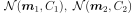
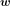
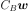
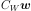
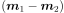
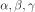

# Fisher's LDA
Linear Discriminant Analysis
> Notes for 2 classes

## Introduction
The objective is to **separate the classes** by picking a new dimension (or direction) to project onto. In other words, LDA aims to maximise the component axes for class separation.
- No assumption on far apart the distributions are
- Assume the 2 distributions are Gaussian with 
- **Idea behind LDA**:
    1. Projected means should be far apart to maximise separation
    2. Within each class, the variance of projections should be small so that each projected class

<!--TODO: insert graph if possible-->

The results can then be used as a linear classifier or for dimensionality reduction before classification.

## Derivation
Assume that  is the direction that the data projects onto.

The distance between the projected means:
_(Squared distance for easier manipulation)_

The variance of projections of two classes:

We can treat the above two equations as between-class variance (**maximise**) and within-class variance (**minimise**) respectively. Therefore, find  that maximises the objective function:

> Note:  given A is symmetric.

![\therefore\textit{Let } \frac{\partial J}{\partial\boldsymbol{w}}=0 \\
\begin{align*}
\boldsymbol{w}^TC_W\boldsymbol{w}\cdot C_B\boldsymbol{w}&=\boldsymbol{w}^TC_B\boldsymbol{w}\cdot C_W\boldsymbol{w} \\
C_B\boldsymbol{w}&=\alpha\cdot C_W\boldsymbol{w} \textit{ where } \alpha=\frac{\boldsymbol{w}^TC_B\boldsymbol{w}}{\boldsymbol{w}^TC_W\boldsymbol{w}} \\
(\boldsymbol{m}_1-\boldsymbol{m}_2)(\boldsymbol{m}_1-\boldsymbol{m}_2)^T\boldsymbol{w}&=\alpha\cdot C_W\boldsymbol{w} \\
\beta\cdot(\boldsymbol{m}_1-\boldsymbol{m}_2)&=\alpha\cdot C_W\boldsymbol{w} \textit{ where }\beta=(\boldsymbol{m}_1-\boldsymbol{m}_2)^T\boldsymbol{w}
\end{align}](images/der5.svg)

Therefore, we can see that  and  shares the same direction of 

Note that  are scalars in the equation and do not matter since we only care about the direction of Fisher's discriminant. The direction projected onto depends on both shapes of the gaussian densities in the final equation.

Finally, project the data onto  and slide the decision threshold (discriminant hyperplane) to compute the TPR and FPR. Plot the TPR against FPR as decision threshold varies, which forms the ROC curve.

> Note: the vector  is the **normal** to the decision threshold (discriminant hyperplane), _i.e._ perpendicular

## ROC and AUC

Receiver operating characteristic (ROC) curve represents trade-offs between true positives (TP) and false positives (FP) in a classifier for different decision thresholds.
- The shape of the ROC curve depends on how much the distributions are overlapping
- Benchmark: 45 degrees diagonal for a random guess model

AUC is a performance measure to compare classifiers that how much the distributions overlap and how well the classifier separates the two classes. It is the **A**rea **U**nder the ROC **C**urve.
- AUC = 0.5: distribution overlaps completely and the classifier is useless
- _Statistically speaking_, when you randomly select a positive sample and a negative sample, the probability that it will rank this positive sample before negative sample is the AUC value (_e.g._ rank which patients are more likely to be sick).
