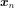

# Linear Regression
Linear regression fits a **linear** model with coefficients (weights) to minimise the residual sum of squares between the targets and the predictions from the linear approximation in the dataset.

This part of the notes (hopefully) explains how linear regression works in a more mathematically detailed way.

## Setup
Data:  \
Model: 

In the dataset, each data point  is in **_p_** dimension with a target  to predict. The model also includes a bias term  to reduce general deviation for all data points. Then, the model contains **_p+1_** unknowns/coefficients can be written like the following for simplicity:

Model:  where

## Derivation
To minimise the errors between targets and predictions (sum of squared residuals):
> In a linear model, the error term is quadratic with the minimal point at zero gradient.

Therefore, we get **_p+1_** equations with **_p+1_** unknowns.

Then, in matrix form,

The error term and the gradient can then be written as:

Finally, to find the minimum error, let 

**The above is also known as the pseudo-inverse solution.**

## Gradient Descent
Gradient descent is a first-order iterative optimisation algorithm to find a local minimum of a **differentiable** function, like the error term here. The idea is to take small steps in the opposite direction of the gradient (or its approximate) of the function to reach its minimum. There are also other ideas of algorithms (optimisers) to escape the **local minimum** and find a better solution closer to the global minimum.

### Algorithms
(Usually initialise the weights at random)

**Steepest Descent** \
Can be costly to compute since it finds the actual gradient of the complete error term, especially when the dataset is large. \

**Second Order** (Newton's Method) \
Can be costly to compute the second order derivatives of the Hessian, saddle points problems (have a read of the StackExchange [discussions](https://stats.stackexchange.com/questions/253632/why-is-newtons-method-not-widely-used-in-machine-learning)), although converging rapidly. \

**Stochastic Gradient Descent** (SGD) \
Popular approach to estimate the gradient by sampling a random data point. \
 where 

## Regularisation
Pseudo-inverse solution can be ill-conditioned if the columns are correlated (multicollinearity). That means within the dataset, the variables are somewhat related to each other. Regularisation can then help the model reduce overfitting by introducing a penalty term to the error function.

### L2 Regularisation
> AKA Tikhonov / ridge regression

- Adds a quadratic penalty term (L2 norm)
- **differentiable**
- Reduce the magnitude of the coefficients (not to 0)

The error function becomes: \

Let , 

### L1 Regularisation
> AKA lasso / sparse regression

- Adds an L1 norm penalty term
- Not differentiable
- **Achieve sparse solution** (reduces the coefficients to 0)
- Similar to selecting relevant features in the dataset
- Help simplify the dimensionality
- Does not handle highly correlated vairables very well

The error function becomes:

<!--TODO: Include Lab 4-->
